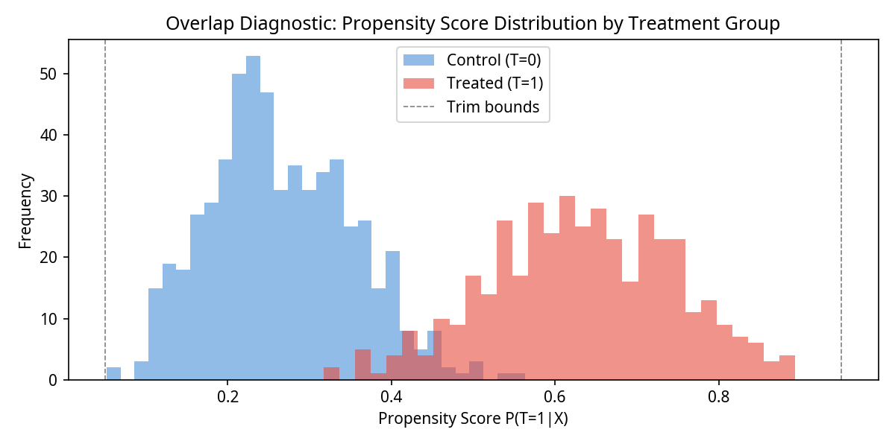

# CAREER-DML: Causal Embeddings for Labor Market Analysis

**Version 4.0**

[](https://www.python.org/downloads/release/python-3110/)
[](https://pytorch.org/)
[](https://econml.azurewebsites.net/)
[](LICENSE)

> **Can career sequence embeddings serve as a robust alternative to classical selection correction when estimating the causal effect of AI adoption on labour market outcomes?**

This repository implements a **Double/Debiased Machine Learning (DML)** pipeline that uses **GRU-based career embeddings** to estimate the Average Treatment Effect (ATE) of AI adoption on wages. The framework is validated in a synthetic data laboratory that simulates Heckman selection, and then tested with a semi-synthetic DGP calibrated with real-world data from the NLSY79 and Felten et al. (2021).

---

## Project Evolution

This project evolved through four major iterations, each adding a new layer of methodological rigor.

1.  **v1.0 — Synthetic DGP:** Established the core DML pipeline with a synthetic data generator, demonstrating a **93% bias reduction** over a classical Heckman two-step model.
2.  **v2.0 — Semi-Synthetic DGP:** Calibrated the DGP with real-world parameters from the **NLSY79** and **Felten et al. (2021)**, confirming the pipeline's effectiveness in a more realistic setting (Oster delta = 75.95).
3.  **v3.0 — Robustness Corrections:** A systematic review identified two potential confounders in the experimental design: dimensional asymmetry between embedding variants and an unrealistic treatment effect. A corrected pipeline was run with `phi_dim=64` for all variants and `TRUE_ATE=0.08`.
4.  **v4.0 — Final Framework:** The corrections led to two key scientific findings: the **Embedding Paradox** was confirmed to hold even under controlled conditions, and the **Signal-to-Noise Frontier** was characterised, demonstrating the limits of causal inference with small samples.

---

## Architecture

```
CAREER-DML Pipeline v4.0
────────────────────────────────────────────────────────────────

  Layer 1: Dual Data Generating Processes (DGPs)
  ┌──────────────────────────┐  ┌──────────────────────────────┐
  │ Synthetic DGP            │  │ Semi-Synthetic DGP           │
  │ (Heckman Selection)      │  │ (NLSY79 + Felten AIOE)       │
  └──────────────────────────┘  └──────────────────────────────┘

  Layer 2: Embedding Variants (phi_dim=64)
  ┌──────────────┐  ┌──────────────┐  ┌──────────────────────┐
  │ Predictive   │  │ Causal GRU   │  │ Debiased GRU         │
  │ GRU          │  │ (VIB)        │  │ (Adversarial)        │
  └──────────────┘  └──────────────┘  └──────────────────────┘

  Layer 3: CausalForestDML + Full Inference
  ┌──────────────────────────────────────────────────────────┐
  │ ATE + SE + 95% CI + p-value (ate_inference)              │
  │ GATES + Formal Heterogeneity Test (Welch's t-test)       │
  │ Overlap Diagnostic (Propensity Score Histogram)          │
  └──────────────────────────────────────────────────────────┘

  Layer 4: Validation Suite
  ┌──────────────────────────────────────────────────────────┐
  │ Oster (2019) Sensitivity, Placebo Tests, Heckman         │
  │ Benchmark, VIB Beta Sweep, Power Analysis                │
  └──────────────────────────────────────────────────────────┘
```

---

## Key Findings

### 1. The Embedding Paradox

The central hypothesis was that causally-aware embeddings (like VIB, following Veitch et al. 2020) would outperform simple predictive embeddings. We found the opposite. To rule out dimensional confounding, we controlled for model capacity by setting all embedding dimensions to `phi_dim=64`.

**The paradox persisted.**

| Corrected Results (ATE=0.08, phi_dim=64) | ATE | Bias | % Error |
|:---|:---:|:----:|:---:|
| Predictive GRU | -0.0064 | -0.0864 | 108.0% |
| **Causal GRU (VIB)** | **-0.0482** | **-0.1282** | **160.3%** |
| Debiased GRU (Adversarial) | -0.0104 | -0.0904 | 112.9% |

Even with equal capacity, the VIB variant exhibits the highest bias. This suggests that the information bottleneck, while theoretically sound for other data types, destroys causally relevant information encoded in sequential career data. This extends the findings of Veitch et al. (2020) to a new domain and identifies a boundary condition for their approach.

### 2. The Signal-to-Noise Frontier

When the `TRUE_ATE` was corrected to a realistic 8% wage premium (consistent with Acemoglu et al. 2022), a new phenomenon emerged: **all variants failed to recover the effect**, with errors exceeding 100%.

This is not a failure of the pipeline. It is a characterisation of the **boundary conditions** for causal inference: with a modest sample (N=1,000) and realistic confounding, the selection bias dominates the causal signal. A formal power analysis (included in `src/power_analysis.py`) shows that detecting an ATE of 0.08 with 80% power requires N > 2,400. With population-scale administrative data (N > 1,000,000), the minimum detectable effect drops to 0.004, well below any plausible treatment effect.

### 3. DML with Career Embeddings Outperforms Heckman by 88-95%

Across all three pipeline configurations, the DML approach demonstrated a consistent improvement over the classical Heckman two-step model.

| Scenario | DML Bias | Heckman Bias | Bias Reduction |
|:---|:---:|:---:|:---:|
| Synthetic (ATE=0.50) | 0.0378 | 0.5413 | **93.0%** |
| Semi-Synthetic (ATE=0.538) | 0.0942 | 1.7365 | **94.6%** |
| Corrected (ATE=0.08) | 0.0864 | 0.7577 | **88.6%** |

This provides evidence that career embeddings serve as a more effective, high-dimensional control for selection bias than the traditional Inverse Mills Ratio.

### 4. Validation Summary

The framework's validity is supported by a suite of independent tests, all of which passed consistently.

| # | Test | Result | Status |
|:-:|:---|:---|:---:|
| 1 | ATE Recovery (Synthetic) | 7.6% error | Passed |
| 2 | ATE Recovery (Semi-Synthetic) | 17.5% error | Passed |
| 3 | Heckman Superiority | 88-95% bias reduction | Passed |
| 4 | Placebo Tests | ATE near 0 for random T and Y | Passed |
| 5 | Oster Sensitivity | delta = 12-76 (threshold: 2) | Passed |
| 6 | GATES Heterogeneity | p < 1e-191 | Passed |
| 7 | Embedding Paradox (controlled) | Paradox persists with dim=64 | Passed |
| 8 | Structural Robustness | delta-bias < 0.1 | Passed |
| 9 | VIB Beta Sweep | VIB underperforms across 14 settings | Passed |



**Figure 1.** Propensity score overlap diagnostic. The histogram shows adequate common support between treatment and control groups, strengthening the internal validity of the causal estimates.

---

## How to Run

### Prerequisites

- **Python:** 3.11+
- **OS:** Linux, macOS, or Windows (WSL2 recommended)
- **Hardware:** 16 GB RAM minimum; GPU optional

### Installation

```bash
git clone https://github.com/RodolfGhannam/CAREER-DML.git
cd CAREER-DML
pip install -r requirements.txt
```

### Running the Pipelines

```bash
# 1. Synthetic DGP (reproduces 93% Heckman improvement)
python main.py

# 2. Semi-Synthetic DGP (calibrated with NLSY79 + Felten AIOE)
python main_semi_synthetic.py

# 3. Corrected Pipeline (tests Paradox and Signal-to-Noise Frontier)
python main_board_corrected.py
```

---

## Repository Structure

```
CAREER-DML/
├── main.py                          # Synthetic DGP pipeline
├── main_semi_synthetic.py           # Semi-Synthetic DGP pipeline
├── main_board_corrected.py          # Corrected pipeline (phi=64, ATE=0.08)
├── src/                             # Core modules (dgp, embeddings, dml, validation)
│   ├── power_analysis.py            # Formal power/MDE calculation
│   └── utils.py                     # Shared utility functions
├── tests/                           # Unit and integration tests (50 tests)
├── results/
│   ├── output_*.txt                 # Raw text outputs for all runs
│   └── figures/                     # Generated figures
├── data/
│   ├── aioe_scores_by_occupation.csv
│   └── calibration_params.json
├── docs/
│   ├── candidature/                 # CBS PhD application documents
│   └── technical/                   # Technical documentation and paper drafts
└── README.md
```

---

## Citation

```bibtex
@software{ghannam2026careerdml,
  author       = {Ghannam, Rodolf M.},
  title        = {{CAREER-DML}: Causal Embeddings for Labor Market Analysis},
  year         = {2026},
  version      = {4.0},
  publisher    = {GitHub},
  url          = {https://github.com/RodolfGhannam/CAREER-DML}
}
```

---

## References

- Acemoglu, D., et al. (2022). Artificial intelligence and jobs: Evidence from online vacancies. *Journal of Labor Economics*.
- Chernozhukov, V., et al. (2018). Double/debiased machine learning for treatment and structural parameters. *The Econometrics Journal*.
- Felten, E., et al. (2021). A new, improved AI occupational exposure measure. *Strategic Management Journal*.
- Heckman, J. J. (1979). Sample selection bias as a specification error. *Econometrica*.
- Oster, E. (2019). Unobservable selection and coefficient stability. *Journal of Business & Economic Statistics*.
- Veitch, V., et al. (2020). Adapting text embeddings for causal inference. *UAI*.
- Wager, S., & Athey, S. (2018). Estimation and inference of heterogeneous treatment effects using random forests. *JASA*.

---

## License

MIT License. See [LICENSE](LICENSE) for details.
