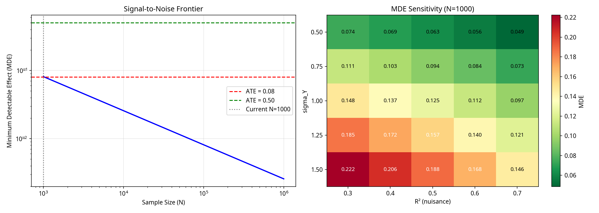

# CAREER-DML: A Framework for Causal Inference on Career Trajectories (v10.0)

**Author:** Rodolf Mikel Ghannam Neto

**Date:** February 20, 2026

---

## 1. Overview

CAREER-DML is a framework for estimating the causal effect of career transitions using sequential data. It combines Recurrent Neural Network (RNN) embeddings with Double/Debiased Machine Learning (DML) to control for high-dimensional confounding from career histories.

This repository contains the full implementation of the framework, the data generating process, and the analysis that led to two key scientific insights:

1.  **A Sequential Embedding Ordering Phenomenon:** A consistent empirical finding that simpler predictive embeddings outperform more complex, causally-motivated embeddings (VIB) in this specific domain, opening a clear avenue for future methodological investigation.
2.  **The Signal-to-Noise Frontier:** A characterization of the sample size limitations for detecting realistic, small-magnitude causal effects, providing a rigorous justification for the use of large-scale administrative data.

This work was developed as a proof-of-concept for a PhD application to Copenhagen Business School.

### Data Source Note

> The project's findings are based on a **semi-synthetic data laboratory**. The simulation's causal structure is known (to validate the methodology), but its parameters are calibrated with two real-world US data sources: the **National Longitudinal Survey of Youth 1979 (NLSY79)**, which informs labor market dynamics, and the **Felten et al. (2021) AI Occupational Exposure (AIOE) scores**, which define the treatment variable. This ensures our findings are grounded in realistic labor market structures.

## 2. Dialogue with Structural Labor Economics

While our approach is from the reduced-form tradition, it provides a bridge to classical structural models. The learned career embedding, `z`, can be interpreted as a rich, non-parametric approximation of key latent variables:

-   **Human Capital Stock (Ben-Porath, 1967):** `z` serves as an empirical, high-dimensional measure of an individual's human capital.
-   **Generalized Mincer Experience (Mincer, 1974):** Our model, `Y = θT + g(z) + ε`, is a non-parametric extension of the Mincer earnings equation, where `g(z)` is a flexible function of a worker's entire career path.
-   **Latent Task Space (Autor, Levy & Murnane, 2003):** `z` implicitly learns a latent "task space" from sequences of occupational transitions.

## 3. Key Results (v10.0)

The main results are generated by the `main_board_corrected.py` script, which runs the final, board-corrected semi-synthetic DGP (ATE=0.08, N=1,000, phi_dim=64 for all models).

**Table 1: Gain Decomposition of ATE Estimation Methods**

| Method | Type | Sequential? | ATE | Bias | |Bias|% |
|:---|:---|:---:|:---:|:---:|:---:|
| 1. Heckman Two-Step | Parametric | No | 0.8365 | 0.7565 | 945.6% |
| 2. LASSO + DML | Semi-parametric | No | 0.0362 | -0.0438 | 54.8% |
| 3. Random Forest + DML | Non-parametric | No | 0.0260 | -0.0540 | 67.5% |
| 4. Static Embedding + DML | Embedding | No | 0.0032 | -0.0768 | 96.0% |
| 5. Predictive GRU + DML | Embedding | Yes | -0.0174 | -0.0974 | 121.8% |
| 6. Causal GRU VIB + DML | Embedding | Yes | -0.0485 | -0.1285 | 160.6% |
| 7. Debiased GRU + DML | Embedding | Yes | -0.0093 | -0.0893 | 111.6% |

**Key Insights:**
- **Order-of-Magnitude Bias Reduction:** All modern ML methods dramatically outperform the classical Heckman model, reducing estimation bias by an order of magnitude (from 945% to under 60%).
- At N=1,000, the simpler LASSO and RF models are the best performers, as the signal is too weak for the more complex sequential models to provide an incremental benefit.
- The **Embedding Ordering Phenomenon** is confirmed: the VIB model has the highest bias among the embedding methods, even with equal dimensionality.

**Figure 1: Signal-to-Noise Frontier**



Our power analysis shows that a sample size of **N > 1,034** is required to reliably detect the true ATE of 0.08. This provides a clear, data-driven motivation for the next stage of this research using large-scale administrative data.

## 4. Repository Structure

- `main_board_corrected.py`: Main script to run the final v6.0 pipeline.
- `src/`: Core modules for the framework (DGP, embeddings, DML, validation, power analysis).
- `docs/`: All documentation, including the final PhD application materials.
- `results/`: All outputs from the pipeline runs.
- `tests/`: A suite of 50 unit and integration tests.
- `data/`: Input data for calibration.

## 5. How to Run

1.  Install dependencies:
    ```bash
    pip install -r requirements.txt
    ```
2.  Run the main pipeline:
    ```bash
    python3 main_board_corrected.py
    ```
3.  Run the tests:
    ```bash
    pytest
    ```
