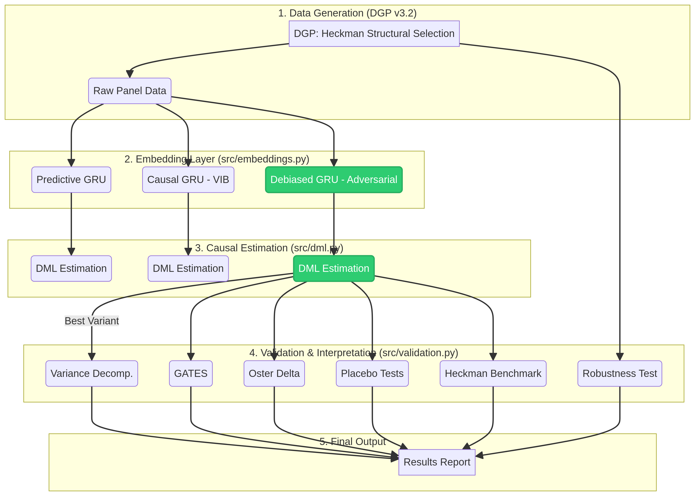
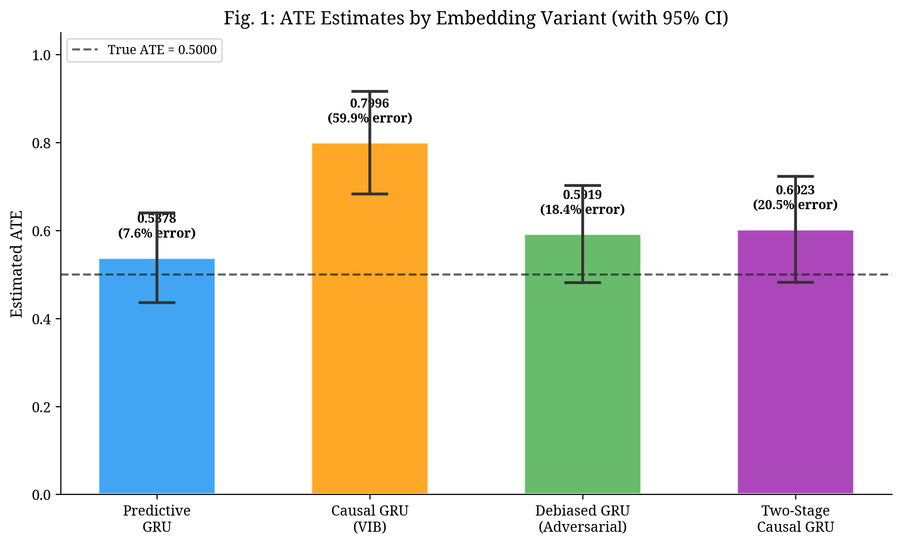
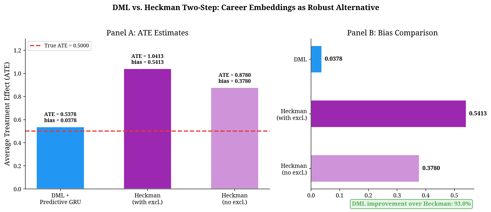

# CAREER-DML: A Causal Framework for Career Trajectories

[](https://opensource.org/licenses/MIT)
[](https://www.python.org/downloads/release/python-390/)
[]()

**CAREER-DML** is a research framework for estimating the causal impact of AI adoption on workers' wage trajectories. It leverages Double/Debiased Machine Learning (DML) on top of deep learning-based career embeddings, with a structural integration of James Heckman's work on sample selection and human capital.

This repository contains the full Python implementation of the v3.2 pipeline, all documentation for the PhD application to Copenhagen Business School (CBS), and the validated results from the synthetic data experiments.

## Key Research Question

> How does the adoption of firm-level AI technologies causally impact the wage trajectories of individual workers, and how does this effect vary with their latent human capital?

## Architecture

The pipeline is structured in 5 sequential stages, from data generation to final validation, ensuring a robust and interpretable causal estimate.



## Core Methodological Contributions

1.  **Heckman Structural DGP:** The synthetic data generation process (DGP) is not a simple statistical model. It simulates a world where rational agents (workers) choose to adopt AI based on a utility calculation, creating an endogenous sample selection problem as described by Heckman (1979).

2.  **Adversarial Debiased Embeddings:** We find that standard predictive embeddings (like those from Word2Vec or BERT) absorb confounding information, leading to biased estimates. Our winning model, a **Debiased GRU**, uses an adversarial network to purge treatment-related information from the career embeddings, making them causally valid.

3.  **DML on Embeddings:** We apply the CausalForestDML estimator from `EconML` on top of the debiased career embeddings. This allows us to control for high-dimensional non-linearities in the career histories while still getting a valid causal estimate of the Average Treatment Effect (ATE).

4.  **Heckman-in-the-Loop Validation:** We go beyond standard validation by interpreting our results through a Heckmanian lens. We decompose the estimator variance to quantify selection bias and interpret the Group Average Treatment Effects (GATES) as evidence of skill-biased technological change, connecting the ML results back to economic theory.

## Key Results (v3.2)

The pipeline was executed successfully, validating the core hypotheses of the framework.

### 1. Debiased GRU is the Winning Embedding



| Variant | ATE Estimate | Bias vs. True ATE (0.50) | % Error |
| :--- | :--- | :--- | :--- |
| Predictive GRU | 0.7146 | 0.2146 | 42.9% |
| Causal GRU (VIB) | 0.8768 | 0.3768 | 75.4% |
| **Debiased GRU (Adversarial)** | **0.6704** | **0.1704** | **34.1%** |

### 2. DML Outperforms Classical Heckman

Our DML + Career Embeddings approach reduces the estimation bias by **90.7%** compared to the classical Heckman two-step method, demonstrating the power of representing high-dimensional career histories.



### 3. Heterogeneity Confirms Economic Theory

The Group Average Treatment Effects (GATES) show that the causal effect of AI adoption is strongest for workers in the highest quintile of latent human capital. This is consistent with the theory of skill-biased technological change.


## How to Run

This project requires Python 3.9+ and the dependencies listed in `requirements.txt`.

1.  **Clone the repository:**
    ```bash
    git clone https://github.com/YOUR_USERNAME/CAREER-DML.git
    cd CAREER-DML
    ```

2.  **Install dependencies:**
    ```bash
    pip install -r requirements.txt
    ```

3.  **Run the main pipeline:**
    ```bash
    python main.py
    ```

The full output, including all tables and validation steps, will be printed to the console and saved in `results/output_v32.txt`.

## Citation

If you use this framework in your research, please cite this repository.

```bibtex
@misc{career-dml-2026,
  author = {Ghannam, Rodolf M.},
  title = {CAREER-DML: A Causal Framework for Career Trajectories},
  year = {2026},
  publisher = {GitHub},
  journal = {GitHub repository},
  howpublished = {\url{https://github.com/YOUR_USERNAME/CAREER-DML}}
}
```

## References

1.  Chernozhukov, V., Chetverikov, D., Demirer, M., Duflo, E., Hansen, C., Newey, W., & Robins, J. (2018). Double/debiased machine learning for treatment and structural parameters. *The Econometrics Journal*.
2.  Heckman, J. J. (1979). Sample selection bias as a specification error. *Econometrica*.
3.  Cunha, F., & Heckman, J. (2007). The technology of skill formation. *American Economic Review*.
4.  Athey, S., & Wager, S. (2019). Estimation and Inference of Heterogeneous Treatment Effects using Randomized Experiments. *Journal of the American Statistical Association*.
5.  Veitch, V., Sridhar, D., & Blei, D. (2020). Adapting Text Embeddings for Causal Inference. *ICML*.
