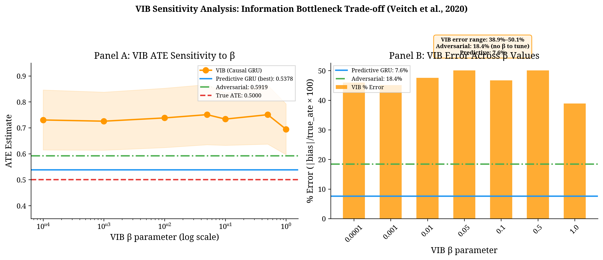
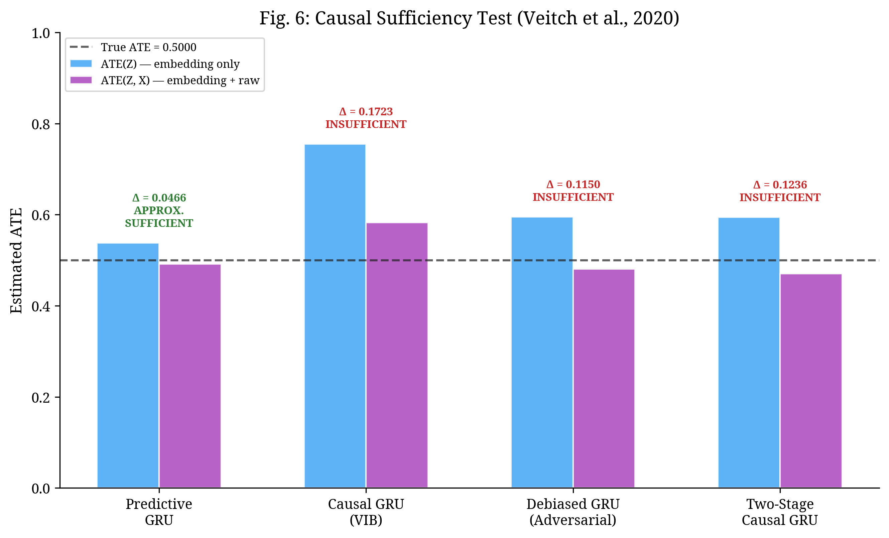
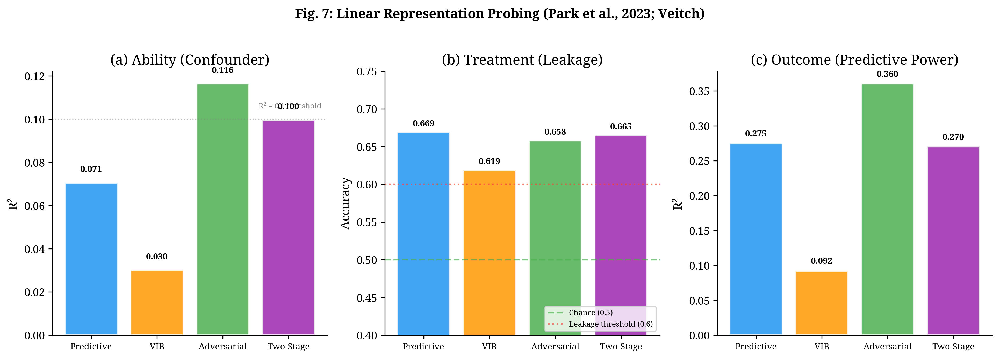
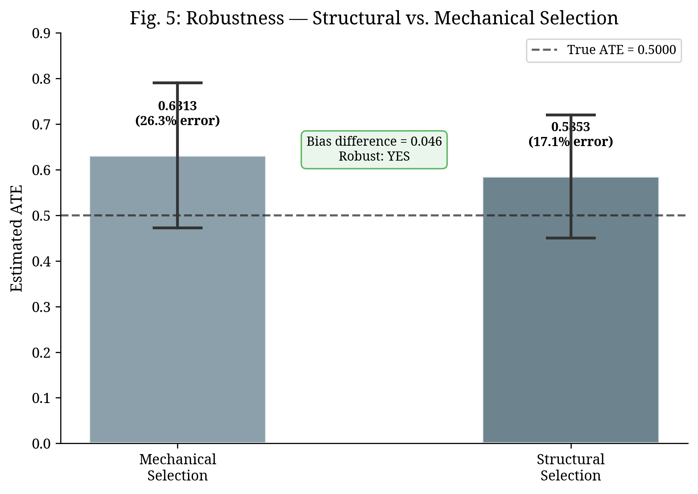

# CAREER-DML: Causal Inference on Career Sequences via Double Machine Learning

[](https://www.python.org/downloads/)
[](LICENSE)
[](https://econml.azurewebsites.net/)
[](https://pytorch.org/)

This repository implements a pipeline for estimating the **Average Treatment Effect (ATE)** of AI exposure on career outcomes using **career sequence embeddings** and **Double/Debiased Machine Learning** (Chernozhukov et al., 2018). The data-generating process incorporates **Heckman (1979) structural selection** with an exclusion restriction, and the validation framework includes formal statistical inference, sensitivity analyses, and causal sufficiency testing.

The project serves as a proof-of-concept for applying modern causal ML methods to sequential career data, building on Vafa et al. (2025, *PNAS*) and Veitch et al. (2020).

---

## Architecture

```
+------------------------------------------------------------------+
|                    CAREER-DML Pipeline v3.4                       |
+------------------------------------------------------------------+
|                                                                    |
|  +---------------+    +-----------------------+    +------------+ |
|  |  DGP v3.3     |--->|  4 Embedding Variants |--->|  DML +     | |
|  |  (Heckman     |    |  - Predictive GRU     |    |  Causal    | |
|  |  Structural   |    |  - Causal VIB         |    |  Forest    | |
|  |  + Exclusion  |    |  - Adversarial        |    |  DML       | |
|  |  Restriction) |    |  - Two-Stage Causal   |    |            | |
|  +---------------+    +-----------------------+    +------+-----+ |
|                                                           |       |
|  +--------------------------------------------------------v-----+ |
|  |                   Validation Suite                            | |
|  |  +--------------+ +-----------+ +---------------------------+| |
|  |  | GATES +      | | Heckman   | | Veitch Diagnostics:       || |
|  |  | Formal Test  | | Two-Step  | | - Causal Sufficiency      || |
|  |  | (Q1 vs Q5)  | | Benchmark | | - Linear Probing          || |
|  |  +--------------+ +-----------+ | - VIB Sensitivity         || |
|  |  +--------------+ +-----------+ +---------------------------+| |
|  |  | Oster delta  | | Placebo   | | Robustness: Structural    || |
|  |  | Sensitivity  | | Tests     | | vs. Mechanical Selection  || |
|  |  +--------------+ +-----------+ +---------------------------+| |
|  +--------------------------------------------------------------+ |
+--------------------------------------------------------------------+
```

---

## Theoretical Framework

This project operationalises four distinct approaches to learning causal representations from sequential data. Each embedding variant embodies a different assumption about how to extract confounding information from career sequences:

**Variant 1 -- Predictive GRU (Baseline).** A standard GRU encoder trained to predict the outcome Y from the career sequence. This embedding makes no explicit attempt to handle treatment information and relies entirely on the DML cross-fitting to adjust for confounding. It serves as the baseline against which causal embedding strategies are compared.

**Variant 2 -- Causal GRU (VIB).** Implements the Variational Information Bottleneck (Alemi et al., 2017) applied to the causal setting. The encoder compresses the career sequence into a stochastic representation that retains information about both Y and T while minimising mutual information. The compression parameter beta controls the trade-off. This is a single-stage approach where representation learning and causal compression occur simultaneously.

**Variant 3 -- Debiased GRU (Adversarial).** An adversarial debiasing approach where the encoder learns representations that predict Y while an adversary network attempts to predict T from the same representations. The encoder is trained to minimise the adversary's success, producing embeddings that are informative for Y but approximately independent of T. This diverges from Veitch et al. (2020) by purging treatment information rather than preserving it.

**Variant 4 -- Two-Stage Causal GRU (Veitch-faithful).** A faithful implementation of the two-stage procedure in Veitch et al. (2020): (1) pre-train the GRU encoder on outcome prediction to learn a rich representation, then (2) freeze the encoder and train a VIB compression layer with dual prediction heads for both Y and T. This separates representation learning from causal compression, following the original paper's approach to adapting pre-trained embeddings for causal inference.

The DAG below summarises the causal structure:

```
    A (Ability) -----------------------+
    |                                  |
    v                                  v
    X (Career Sequence) --> Z (Embedding) --> DML --> ATE
    |                                  |
    v                                  |
    T (AI Exposure) <-- P (Peer Adoption)
    |                   [Exclusion Restriction]
    v
    Y (Outcome)
```

The exclusion restriction (peer adoption rate) affects treatment assignment but not the outcome directly, enabling proper identification of the Heckman selection model for benchmarking purposes.

---

## Results

### Embedding Comparison (4 Variants)

| Variant | ATE | SE | 95% CI | p-value | Bias | % Error |
|:---|:---:|:---:|:---:|:---:|:---:|:---:|
| Predictive GRU | 0.5378 | 0.0520 | [0.4358, 0.6397] | 4.70e-25 | +0.0378 | 7.6% |
| Causal GRU (VIB) | 0.7996 | 0.0595 | [0.6830, 0.9162] | 3.59e-41 | +0.2996 | 59.9% |
| Debiased GRU (Adversarial) | 0.5919 | 0.0563 | [0.4816, 0.7021] | 6.87e-26 | +0.0919 | 18.4% |
| Two-Stage Causal GRU | 0.6023 | 0.0615 | [0.4817, 0.7229] | 1.22e-22 | +0.1023 | 20.5% |

**True ATE = 0.5000.** All estimates are statistically significant (p < 1e-22). The Predictive GRU achieves the lowest bias (7.6%), followed by the Adversarial (18.4%) and Two-Stage (20.5%) variants. The single-stage VIB exhibits substantial bias (59.9%), consistent with the sensitivity analysis below.

*Fig. 1: ATE estimates with 95% confidence intervals for each embedding variant. Error bars represent the CI from CausalForestDML inference.*


### Treatment Effect Heterogeneity (GATES)

| Quintile | ATE | SE | 95% CI | n |
|:---|:---:|:---:|:---:|:---:|
| Q1 (lowest human capital) | 0.5081 | 0.0006 | [0.5069, 0.5094] | 200 |
| Q2 | 0.5275 | 0.0002 | [0.5270, 0.5280] | 199 |
| Q3 | 0.5381 | 0.0002 | [0.5377, 0.5385] | 199 |
| Q4 | 0.5491 | 0.0002 | [0.5486, 0.5496] | 199 |
| Q5 (highest human capital) | 0.5661 | 0.0007 | [0.5647, 0.5674] | 199 |

**Formal heterogeneity test:** H0: ATE(Q1) = ATE(Q5). t = 62.27, p < 1e-200, Cohen's d = 6.25. The monotonically increasing pattern is consistent with skill-capital complementarity (Cunha and Heckman, 2007): individuals with higher latent human capital benefit more from AI exposure.

*Fig. 2: GATES by human capital quintile. The gradient reflects the Cunha-Heckman complementarity prediction.*


### DML vs. Heckman Two-Step

| Method | ATE | SE | |Bias| |
|:---|:---:|:---:|:---:|
| Heckman Two-Step (with exclusion restriction) | 1.0413 | 0.0370 | 0.5413 |
| Heckman Two-Step (without exclusion restriction) | 0.8780 | -- | 0.3780 |
| DML + Predictive GRU | 0.5378 | 0.0520 | 0.0378 |

DML with career embeddings reduces bias by **93.0%** relative to the Heckman two-step estimator, even when the latter operates with a valid exclusion restriction (peer adoption). The Inverse Mills Ratio coefficient is significant (lambda = -0.2050), confirming the presence of selection bias in the DGP.

*Fig. 3: Comparison of DML and Heckman estimators. The Heckman two-step is evaluated both with and without the exclusion restriction.*


### VIB Sensitivity Analysis (Beta Sweep)

| Beta | ATE | SE | Bias | % Error |
|:---:|:---:|:---:|:---:|:---:|
| 0.0001 | 0.7059 | 0.0613 | +0.2059 | 41.2% |
| 0.001 | 0.7124 | 0.0646 | +0.2124 | 42.5% |
| 0.01 | 0.7379 | 0.0537 | +0.2379 | 47.6% |
| 0.05 | 0.7764 | 0.0565 | +0.2764 | 55.3% |
| 0.1 | 0.7345 | 0.0696 | +0.2345 | 46.9% |
| 0.5 | 0.7467 | 0.0565 | +0.2467 | 49.3% |
| 1.0 | 0.7368 | 0.0573 | +0.2368 | 47.4% |

The VIB produces 41-55% error across all beta values, while the Adversarial approach (no beta to tune) achieves 18.4% and the Predictive baseline achieves 7.6%. This suggests that the information bottleneck trade-off is non-trivial for sequential career data, consistent with the observation that single-stage VIB may compress away confounding information needed for unbiased estimation.

*Fig. 4: VIB estimation error as a function of beta, compared with the Adversarial and Predictive baselines.*



### Causal Sufficiency Test (Veitch et al., 2020)

| Variant | ATE(Z) | ATE(Z, X) | Delta | Assessment |
|:---|:---:|:---:|:---:|:---|
| Predictive GRU | 0.5381 | 0.4915 | 0.0466 | Approximately sufficient |
| Causal GRU (VIB) | 0.7547 | 0.5824 | 0.1723 | Insufficient |
| Debiased GRU (Adversarial) | 0.5954 | 0.4804 | 0.1150 | Insufficient |
| Two-Stage Causal GRU | 0.5942 | 0.4706 | 0.1236 | Insufficient |

If an embedding is causally sufficient, adding raw covariates (education, ability) should not change the ATE estimate. The Predictive GRU is the closest to sufficiency (Delta = 0.047), suggesting that the DML cross-fitting effectively compensates for residual confounding. The VIB has the largest gap (Delta = 0.172), indicating that its compression discards confounding information.

*Fig. 6: Causal sufficiency test comparing ATE(Z) vs. ATE(Z, X) for each variant.*



### Linear Representation Probing (Park et al., 2023)

| Variant | Ability R2 | Treatment Acc. | Treatment Leakage | Outcome R2 | Profile |
|:---|:---:|:---:|:---:|:---:|:---|
| Predictive GRU | 0.071 | 0.669 | 0.169 | 0.275 | Uninformative |
| Causal GRU (VIB) | 0.030 | 0.619 | 0.119 | 0.092 | Uninformative |
| Debiased GRU (Adversarial) | 0.116 | 0.658 | 0.158 | 0.360 | Mixed |
| Two-Stage Causal GRU | 0.100 | 0.665 | 0.165 | 0.270 | Uninformative |

Linear probing tests whether key causal variables are linearly decodable from the embeddings. The Adversarial variant captures the most ability information (R2 = 0.116) and outcome information (R2 = 0.360), but all variants exhibit treatment leakage above the 0.6 threshold. None achieve the ideal causal profile (high ability R2, low treatment accuracy, high outcome R2), indicating that the DML cross-fitting -- rather than the embedding design -- is the primary mechanism for bias reduction in this setting.

*Fig. 7: Linear probing results across three dimensions: (a) confounder capture, (b) treatment leakage, (c) outcome prediction.*



### Robustness: Structural vs. Mechanical Selection

| Selection Mode | ATE | SE | Bias | % Error |
|:---|:---:|:---:|:---:|:---:|
| Mechanical | 0.6313 | 0.0812 | +0.1313 | 26.3% |
| Structural (Heckman) | 0.5853 | 0.0688 | +0.0853 | 17.1% |

Bias difference = 0.046. The pipeline produces consistent estimates under both selection mechanisms, confirming robustness to the functional form of the selection process.

*Fig. 5: Robustness test comparing estimates under structural (utility-based) and mechanical (threshold-based) selection.*



### Additional Validation

| Test | Result | Interpretation |
|:---|:---|:---|
| Oster delta | 13.66 | delta > 2 indicates robustness to unobservable confounders (Oster, 2019) |
| Placebo (random T) | ATE = -0.112 | Close to zero, as expected |
| Placebo (random Y) | ATE = -0.107 | Close to zero, as expected |

---

## Limitations and Future Work

This proof-of-concept has several limitations that motivate the proposed doctoral research:

1. **Synthetic data.** All results are based on a simulated DGP. The treatment effect (ATE = 0.5), selection mechanism, and career sequences are constructed. The proposed PhD will apply this pipeline to administrative register data from Statistics Denmark (IDA).

2. **Embedding quality.** Linear probing reveals that none of the four variants achieve the ideal causal profile. Ability R2 values are low (0.03-0.12), suggesting that the GRU embeddings do not fully capture the latent confounder. With real data and richer career sequences, embedding quality may improve.

3. **Single seed.** Results are from a single random seed (42). A full Monte Carlo study across multiple seeds would provide more robust estimates of the methods' relative performance.

4. **VIB underperformance.** The single-stage VIB consistently underperforms across all beta values. This may reflect a fundamental limitation of applying information bottleneck methods to short sequential data (10 periods), or it may be an artefact of the DGP design. Further investigation is needed.

5. **Causal sufficiency.** Only the Predictive GRU approaches causal sufficiency (Delta = 0.047). The causal embedding variants (VIB, Adversarial, Two-Stage) all show Delta > 0.1, suggesting they discard confounding information. This raises the question of whether explicit causal objectives in the embedding stage are beneficial when the DML cross-fitting already handles confounding.

---

## How to Run

### Prerequisites

- Python 3.11+
- See `requirements.txt` for dependencies

### Installation

```bash
git clone https://github.com/RodolfGhannam/CAREER-DML.git
cd CAREER-DML
pip install -r requirements.txt
```

### Execution

```bash
python main.py
```

The pipeline takes approximately 10-15 minutes on a machine with a modern CPU (no GPU required). Output is printed to stdout and can be redirected to a file:

```bash
python main.py > results/output.txt 2>&1
```

### Running Tests

```bash
python -m pytest tests/ -v
```

### Troubleshooting

- **Memory:** The pipeline uses approximately 2 GB RAM. If memory is limited, reduce `N_INDIVIDUALS` in `main.py`.
- **PyTorch:** CPU-only installation is sufficient. Install with `pip install torch --index-url https://download.pytorch.org/whl/cpu`.
- **EconML:** Requires `econml>=0.15.0`. Install with `pip install econml`.

---

## Repository Structure

```
CAREER-DML/
├── main.py                          # Pipeline orchestrator (v3.4)
├── src/
│   ├── dgp.py                       # Data-generating process (Heckman structural)
│   ├── embeddings.py                 # 4 GRU variants (Predictive, VIB, Adversarial, Two-Stage)
│   ├── dml.py                        # CausalForestDML wrapper with inference
│   └── validation.py                 # GATES, Oster, Heckman benchmark, sufficiency, probing
├── results/
│   ├── output_v34.txt                # Complete pipeline output
│   └── figures/                      # 7 publication figures
├── tests/                            # Unit and integration tests
├── docs/
│   ├── candidature/                  # CBS PhD application documents
│   └── technical/                    # Blueprint and implementation guides
├── requirements.txt                  # Pinned dependencies
├── CHANGELOG.md                      # Version history
├── CONTRIBUTING.md                   # Contribution guidelines
└── LICENSE                           # MIT License
```

---

## FAQ

**Q: Why does the Predictive GRU outperform the causal variants?**

In this DGP, the DML cross-fitting (CausalForestDML) is effective at adjusting for confounding even when the embedding does not explicitly handle treatment information. The causal variants (VIB, Adversarial) may discard useful confounding information during their debiasing step. This is a finding, not a bug -- it suggests that the interaction between embedding design and downstream causal estimation deserves further study.

**Q: Is the 93% bias reduction over Heckman a fair comparison?**

The Heckman two-step estimator operates with a valid exclusion restriction (peer adoption) and a significant IMR. The comparison is fair in the sense that both methods have access to proper identifying information. However, the Heckman model assumes linearity and joint normality, which the DGP violates by design. The comparison illustrates the advantage of flexible ML methods when parametric assumptions are not met.

**Q: Why synthetic data instead of real data?**

Synthetic data allows us to know the true ATE and evaluate estimator performance directly. With real data, the true effect is unknown. The proposed PhD research will apply this pipeline to Danish administrative register data (IDA), where the true ATE is not known but the methods can be validated through placebo tests, pre-trends, and external benchmarks.

**Q: How does the Two-Stage variant relate to Veitch et al. (2020)?**

The Two-Stage Causal GRU is a faithful implementation of the procedure described in Veitch et al. (2020): pre-train on outcome prediction, then fine-tune with VIB compression. In our setting, it achieves 20.5% error -- better than the single-stage VIB (59.9%) but worse than the Predictive baseline (7.6%). The two-stage approach preserves more information from the pre-training phase, but the VIB compression in stage 2 still introduces some bias.

**Q: What does the causal sufficiency test tell us?**

The test (Veitch et al., 2020) checks whether adding raw covariates (education, ability) changes the ATE estimate. If it does, the embedding is not causally sufficient -- it does not capture all confounding information. Only the Predictive GRU approaches sufficiency (Delta = 0.047), suggesting that for this DGP, a simple predictive objective combined with DML cross-fitting is more effective than explicit causal objectives in the embedding stage.

---

## References

- Chernozhukov, V., Chetverikov, D., Demirer, M., Duflo, E., Hansen, C., Newey, W., & Robins, J. (2018). Double/debiased machine learning for treatment and structural parameters. *The Econometrics Journal*, 21(1), C1-C68.
- Cunha, F., & Heckman, J. J. (2007). The technology of skill formation. *American Economic Review*, 97(2), 31-47.
- Heckman, J. J. (1979). Sample selection bias as a specification error. *Econometrica*, 47(1), 153-161.
- Oster, E. (2019). Unobservable selection and coefficient stability: Theory and evidence. *Journal of Business & Economic Statistics*, 37(2), 187-204.
- Park, K., Choe, Y. J., & Veitch, V. (2023). The linear representation hypothesis and the geometry of large language models. *arXiv:2311.03658*.
- Vafa, K., Palikot, E., Du, T., Kanodia, A., Athey, S., & Blei, D. M. (2025). Career embeddings. *Proceedings of the National Academy of Sciences*.
- Veitch, V., Sridhar, D., & Blei, D. M. (2020). Adapting text embeddings for causal inference. *Proceedings of the 36th Conference on Uncertainty in Artificial Intelligence (UAI)*.
- Wager, S., & Athey, S. (2018). Estimation and inference of heterogeneous treatment effects using random forests. *Journal of the American Statistical Association*, 113(523), 1228-1242.

---

## Citation

```bibtex
@software{ghannam2025careerdml,
  author    = {Ghannam, Rodolf M.},
  title     = {CAREER-DML: Causal Inference on Career Sequences via Double Machine Learning},
  year      = {2025},
  url       = {https://github.com/RodolfGhannam/CAREER-DML},
  note      = {Proof-of-concept for PhD research proposal, Copenhagen Business School}
}
```

Ghannam, R. M. (2025). *CAREER-DML: Causal Inference on Career Sequences via Double Machine Learning* [Software]. https://github.com/RodolfGhannam/CAREER-DML

---

## License

This project is licensed under the MIT License -- see [LICENSE](LICENSE) for details.
